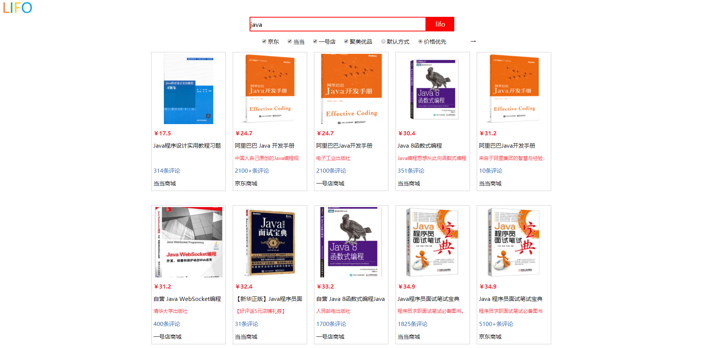

## SSM框架Demo之 lifo实时比价系统
### 1.功能描述
多个商城所查商品的在线实时比价。
### 2.功能展示

### 3.模块难度

| 模块 | 难度 |
|---|---|
| SSM框架 | ★★★ |
| 爬虫 | ★★★★ |
| 页面设计 | ★★★ |
| 逻辑设计 | ★★★☆ |

### 4.设计和思路分析
[SSM框架Demo之lifo实时比价系统](https://lifoer.github.io/2018/04/15/SSM框架Demo之lifo实时比价系统/)
